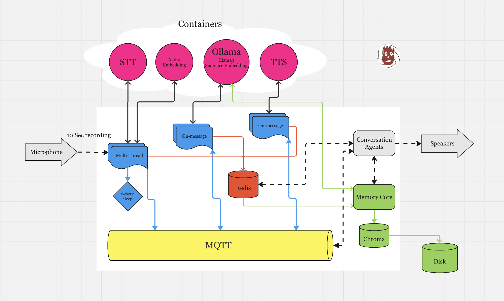

Wilson takes its name from the iconic character "Wilson" in the movie *Cast Away*. In the film, Wilson was a volleyball that served as the loyal companion to Tom Hanks' character, providing comfort and companionship despite being a simple object.

Wilson, the AI voice assistant, runs on PCs and laptops, leveraging the CPU’s power. Built using open-source projects, it offers a platform for developers to explore and experiment with AI-driven scenarios such as voice-to-text, text-to-speech, language model interactions, and creating agents capable of maintaining coherent conversations. Like the movie’s Wilson, this assistant is designed to be a reliable and helpful companion, always there to assist you with tasks and provide a friendly, accessible interaction. Wilson is built to be dependable and responsive in any environment.

# Architecture:



Wilson's architecture is modular, built on containerized services that handle different tasks such as voice-to-text, text-to-speech, and language processing. It allows flexibility in configuration and deployment, making it easy for developers to switch components or add new services.

# Components:

Wilson’s capabilities are powered by a suite of advanced components, each designed to handle specific tasks seamlessly:

- MQTT Broker: Manages message brokering and communication between processes.
- Redis: Serves as short-term memory for quick data retrieval and caching.
- Chroma: Provides long-term memory storage, ensuring persistent data retention.
- Audio Embedding: Converts audio data into meaningful vector representations.
- Wakeup and Sleep Logic: Handles the activation and deactivation of the assistant based on user interaction.
- Whisper: Performs speech-to-text (STT) conversion with high accuracy.
- Speaker Diarization: Identifies and differentiates between multiple speakers in an audio stream.
- Emotion Detection: Analyzes speech to detect and interpret emotional states.
- Ollama: Serves Llama3 and mxbai-embed-large models for advanced language processing and embeddings.
- Microsoft SpeechT5: Provides text-to-speech (TTS) capabilities, converting text into natural-sounding speech.
- MelOTTS: Enhances TTS with Mel-Spectrogram features for improved audio quality.
- Pythonic Conversation Agents: Facilitates engaging and intuitive interactions through conversational agents.

# Run Wilson:

To start Wilson, run the following command (tested on MacOS with python3.8):

```
pip install -r requirements.txt
python wilson.py
```

This command launches the core system of the voice assistant.

# Services:

Wilson relies on several services, each running in its own container to ensure scalability and separation of concerns. Below are the commands to build and run each service:

## Whisper for Speech-to-Text (STT) and Microsoft speecht5 for Text-to-Speech (TTS) Service:

```
docker buildx build --platform=linux/arm64 -t stt_tts .
docker run -p 8000:8000 stt_tts
```
Note: Speaker Diarization and Emotion Detection happens during STT

## Language Model Service (using Ollama):

```
ollama pull llama3
ollama pull mxbai-embed-large
ollama serve
```

## Audio Mel-Spectrogram to Text (MelOTTS) Service:

```
docker buildx build --platform=linux/arm64 -t melotts .
docker run -p 8888:8888 melotts
```

## Pyannote Audio Embedding Service:

```
docker buildx build --platform=linux/arm64 -t embedding .
docker run -p 8080:8080 embedding
```

# Assets:

The folder includes scripts and folder structures designed for creating and storing pre-synthesized audio files for various purposes, such as greetings and more. You can edit and execute the scripts as needed.

```
python processing.py
```

Record the wakeup and sleep calls:

```
python recording.py sleepwords.wav
python recording.py wakeupwords.wav
```

# Milestones:

- **Version 1.0 Release**: Introduces basic features such as automated processes untilizing voice-to-text, text-to-speech, and natural language understanding.

- **Merging STT-TTS components**: Integrating Melotts, which is developed using Python 3.9 with the STT-TTS module (built with Python 3.8).

- **Expanding Conversational Agents**: Enhancing the conversation agents and potentially adding new agents that support internet searching.

    **Note**: 
    A conversation includes:
    - The assistant can listen to you.
    - The assistant can speak to you.
    - The assistant can interrupt you and start talking.
    - You can interrupt the assistant and start talking.

    The goal is to create a coherent, real-time conversation flow that "ADAPTS" as the interaction progresses.

- **Editing Personality for Large Language Models**: Referring to the research on editing personality in language models (https://arxiv.org/pdf/2310.02168). Additionally,  TTS models can reflect specific personality traits through different voice style (try to compare Melotts and Microsoft speecht5).

- **GUI for Task Management**: Developing a GUI for managing tasks such as wakeup/sleep word tuning, language settings, and more.

- **Project Packaging**: Using PyInstaller (https://github.com/pyinstaller/pyinstaller) to package the project for cross-platform distribution, ensuring easy installation for non-developers without extra setup hassle.

# License:

Wilson is an open-source project licensed under the MIT License. Feel free to use, modify, and distribute this project as long as the terms of the license are followed.

# Contribution:

We welcome contributions! If you're interested in contributing to Wilson, please follow these steps:

1. Fork the repository.
2. Create a new branch (`git checkout -b feature/YourFeature`).
3. Commit your changes (`git commit -am 'Add some feature'`).
4. Push the branch (`git push origin feature/YourFeature`).
5. Open a pull request and describe your changes.

# Contact:

For any questions or inquiries, feel free to contact us at:

[Find me here](https://www.linkedin.com/in/amin-abbasloo-3a2747121/)


